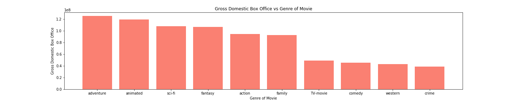
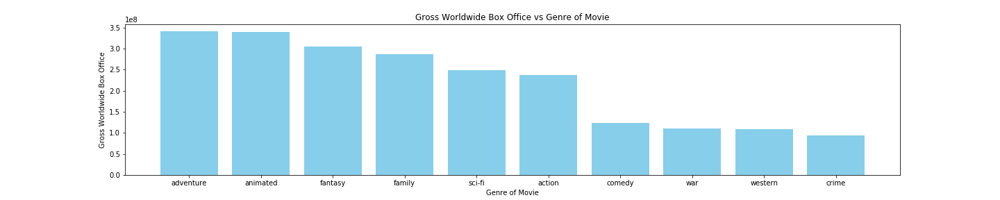
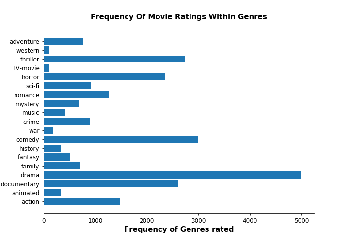
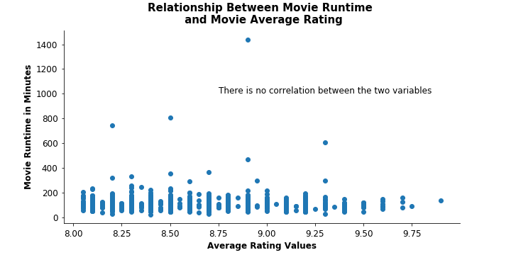

# Entering the Movie Industry

**Authors**: Justin Fernandez, Lhamu Tsering

## Overview


In this project our team is tasked to look at movie data in order to discover insights that can help Microsoft be successful in the video content industry. The data used comes from websites that specialize in movies/tv-shows like Box Office Mojo, IMDb, Rotten Tomatoes, and TheMovieDB.org. The methods used in this research will focus on manipulating the current data in order to gain insight on what movies are successful, who is part of successful movies, genres of movies rated and ideal movie runtime. The results below shows that adventure, animated, and sci-fi movies are the genres that Microsoft should consider based on grosss box office earnings. Microsoft should also consider movies in the drama, horror, thriller and documentary genre based on how often movies in these categories get voted on. It also shows the writers, actors, and directors who have been part of highly rated movies.


## Business Problem


Microsoft wants to join in on the other big companies starting to make video content like Netflix, Hulu, and many others. Without much experience in the field, they need our help with getting an insight into what kind of content they should be creating to be successful. The question we seek to answer are:

1. What genre of movie is the most successful domestically / worldwide?
2. Who should be hired to give the highest chance of a highly rated movie?
3. What genre of movies are people most excited about voting on ?
4. Are movie ratings affected by movie runtimes ?


## Data


The data used in this project comes from websites that specialize in movies/tv-shows and all information on those. The websites are Box Office Mojo, IMDb, Rotten Tomatoes, and TheMovieDB.org.
The datasets provide information on the various movies, their genre, the box office earnings, movie ratings, movie runtimes and the movie crew members.


## Methods


This project looks at trends of movies based on the various available characteristics of movies in the sample data. This allows us to identify the traits of a successful movie in terms of who to hire, what genre the movie plot should be, and the length of the movie.
Descriptive analysis was used on the average ratings data to assess its distribution and to check on the trends of genres of movies that were rated


## Results

Following are the analysis results by question:

#### Question 1 (a)
The results of this inquiry shows that the American populations favorite genres of movies are adventure, animated, sci-fi, fantasy, action, and family.


#### Question 1 (b)
The results of this question shows that worldwide the genres of movies that have the highest mean box office are adventure, animated, fantasy, family, sci-fi, and action.


#### Question 2
The results here show that there are actors, actresses, directors, and writers who were a part of movies that were rated very highly.


#### Question 3
People are most excited to watch movies that fall in the drama, thriller. horror and documentary genre


#### Question 4
Average Rating of a movie has no correlation with how long a movie runs.


## Conclusions

In conclusion, our analysis leads to the following recommendations to Microsoft:

1. Movies in the genres of adventure, animated, sci-fi, fantasy, action, and family have grossed the highest at the American box office. In terms of earnings these are the genres that Microsoft should explore.
2. Microsoft should hire movie crew members who have historically worked on successful movies.
3. Exploring movies in the drama, thriller, horror and documentary genre may also be fruitful for Microsoft when deciding on what kinds of movie to make
4. When movie viewers rate movies, the length of the movie does not affect whether they vote on a movie or not and how well they vote. Microsoft should not be too concerned about the length of a movie being a putoff.


## Limitations and Next Steps

Limitations of this dataset was that it was constrained to movies in the the four source sites, that are very similar in what they offer. The dataset also was much lacking with missing values and/or null values for several observations. Further steps must be taken to seek out better data that assess the success of a movie.
To be with the times of our current situation, the next steps would be to look at data from movies released in the last year to assess how the COVID pandemic affected the movie industry. Getting a dataset with less null values to improve the findings that we have made with the current dataset


## For More Information

Please review our full analysis in [our Jupyter Notebook](./movie-data-analysis.ipynb) or our [presentation](./Movie-Data-Analysis-Presentation.pdf).

For any additional questions, please contact **Lhamu Tsering boutlhamu@gmail.com & Justin Fernandez justin.miguel.fernandez@gmail.com**

## Repository Structure

Describe the structure of your repository and its contents, for example:

```
├── README.md                           <- The top-level README for reviewers of this project
├── movie-data-analysis.ipynb   <- Narrative documentation of analysis in Jupyter notebook
├── Movie-Data-Analysis-Presentation.pdf         <- PDF version of project presentation
├── data                                <- Both sourced externally and generated from code
└── images                              <- Both sourced externally and generated from code
```
